# Requirements

-   Jupyter
-   Torch
-   Numpy
-   Tensorflow
-   Keras
-   etc.

    For the specific version, see [/easy-few-shot-learning-master/dev_requirements.txt](https://github.com/yylixianji/current-based-tool-wear-detection-with-FSL-and-TL/blob/main/easy-few-shot-learning-master/dev_requirements.txt).

# Description

This project compares the normal and abnormal tool motor currents from PLC of CNC through different Few-Shot Learning (FSL) and Transfer Learning (TL) algorithms. Immediately after, it compares the performance of different algorithms. During this period, it requires to tune the hyperparameters to ensure the superior performance of each algorithm. Finally, the best classification model will be found.

# Algorithms
reference repo [clone sicara/easy-few-shot-learning](https://github.com/sicara/easy-few-shot-learning.git)

## Algorithm basis

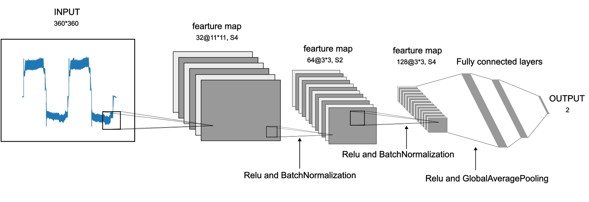

Fig 2.1 The structure of my own CNN based on Le-net 5

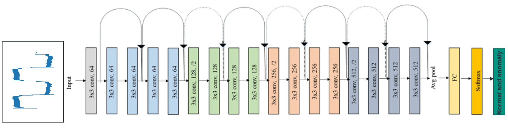

Fig 2.2 The structure of ResNet 18

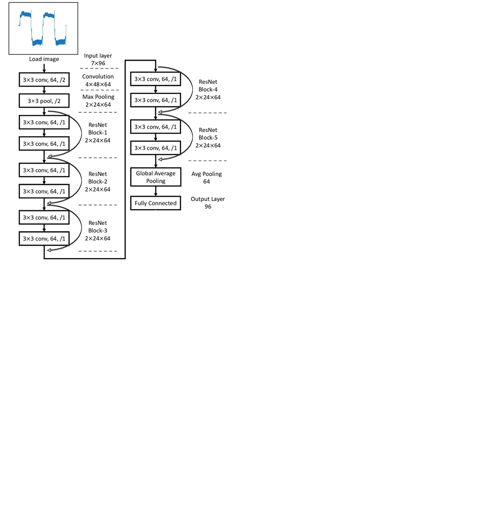

Fig 2.3 The structure of ResNet 12

## Flowchart

### Metric based few-shot learning

Fig 3.1 Schematic diagram of SNN

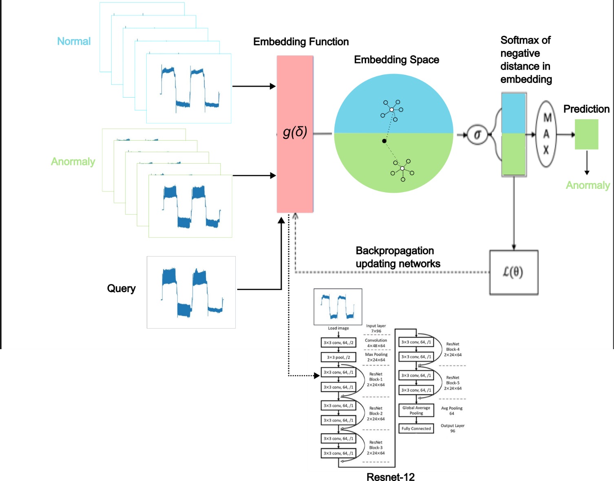

Fig 3.2 Schematic diagram of Prototypical neural network

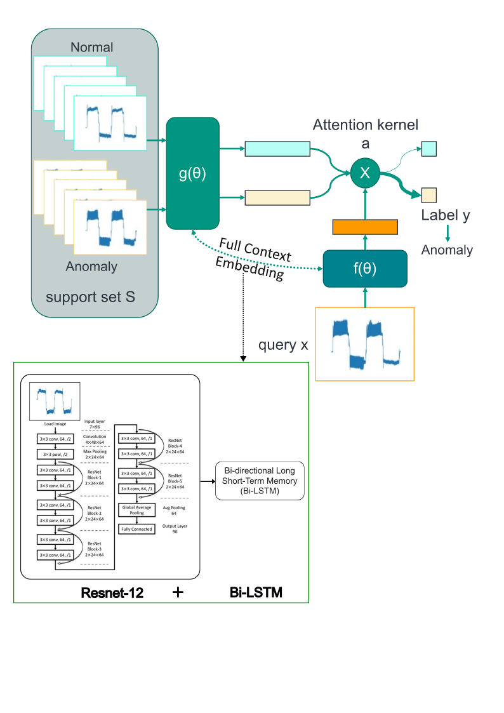

Fig 3.3 Schematic diagram of Matching network

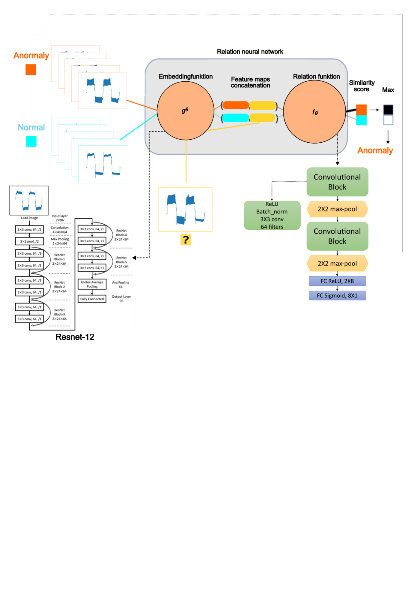

Fig 3.4 Schematic diagram of Relation network

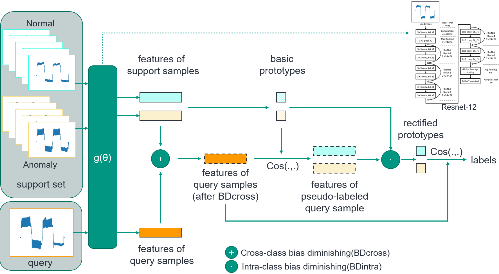

Fig 3.5 Schematic diagram of prototype rectification network

### Procedure

We got all the processed data and then we should create the dataset and feed them to the few-shot learning algorithm. The total samples number is 108. 72 of them are the training set and 36 are the test set. The general flowchart is as follows, for the specific 5 algorithms (SNN, PNN, RN, MN) already mentioned above.

First, it is the training process (Fig 3.6):

The dataset is divided into 2 parts: 36 normally samples and 36 anomaly samples. In every epoch, 5 of normal samples and anomaly samples will be selected to feed to the metric-based learning algorithms. That is called 2ways-5shots support set: 2 classes and each class have 5 samples. Then a similarity compare model will be trained through backpropagation. By means of hyperparameter tuning people can get the classification between normal and anomaly.

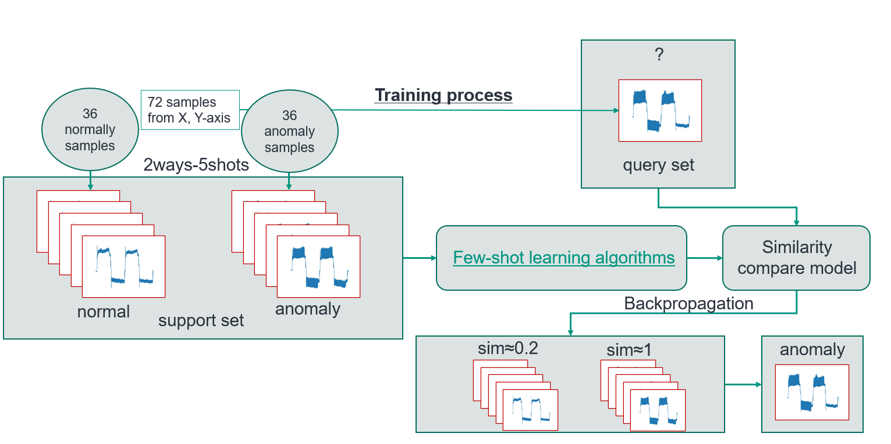

Fig 3.6 Flow chart for training process in metric-based learning

Secondly, it is the testing process (Fig 3.7):

It is similar to training process. The difference is the input data. It’s 36 samples from S-axis. And put them into the already trained model from training process. At last. We do 15 tests like that and get the performance.

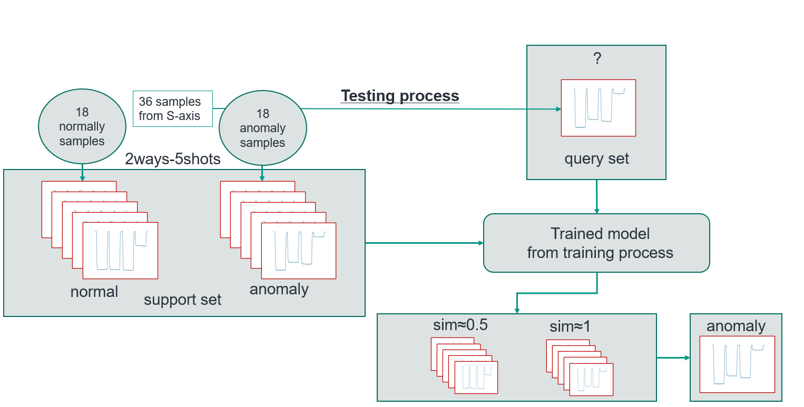

Fig 3.7 Flow chart for testing process in metric-based learning

At first, I created a binary classification model of the misalignment data. Use CNN as the feature extraction and save the weights of the best model. Then, share the weight of the feature extraction of the pre-trained model to the new model. That means only change the flatten layer and frozen the other part of feature extraction algorithms. Put the D12 tool data into it and add the fully connected layer and SoftMax function can man get the classification result (Normal and Anomaly). Through the existing weights of pretrain model, it can quick to train a good model with new D12 tool data. Save the weights of D12 tool model then. Afterwards, send the D16 tool data into the Feature extraction algorithm from D12 model, similarly, share the weight. People can easily get an improved model rather than learn from zero. At last, likely, send the D20 tool data to the model trained from D16 tool can man get another good model. So, if there is a new dataset D24 for example, people can get the classification model quickly from the previous model through transfer learning of D20 tool (Fig 3.8).

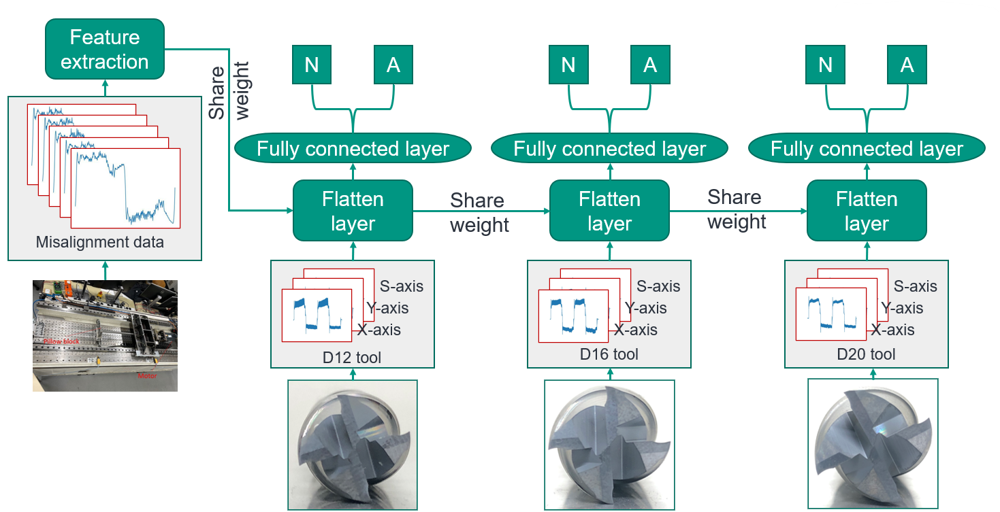

Fig 3.8 The procedure of transfer learning

# Data collection and processing

current signal from PLC of CNC .json files .csv files image files (Fig 4.1)

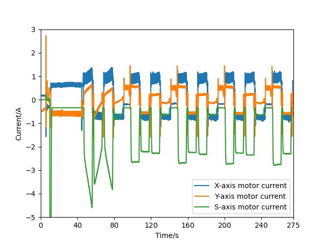

Fig 4.1 Current in X, Y, S-axis with D16 tool normal condition

Divide them into 3 axes, further by periods (Fig 4.2).

Fig 4.2 Current in X-axis with D16 tool normal condition (1 period)

We got all the processed data and then we should create the dataset and feed them to the few-shot learning algorithm. The total samples number is 108. 72 of them are the training set and 36 are the test set. The general flowchart is as aboves, for the specific 5 algorithms (SNN, PNN, RN, MN) already mentioned.

# Results

## Metric based few-shot learning

Here the CNN based on Lenet-5 is used for Siamese neural networks and Transfer learning. The Resnet-12 is used for other algorithms. And we experimented with the three methods separately: 2ways-5shot, 2ways-10shots and 2ways-20shots.

Following is the example, it is the performance with confusion matrix of SNN, it can be found that the accuracy of the best performance of 2ways-5, 10, 20shots is respectively 86.7%, 90%, 93.3% (Fig 5.1(a)(b)(c)).

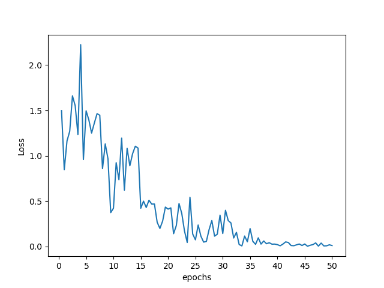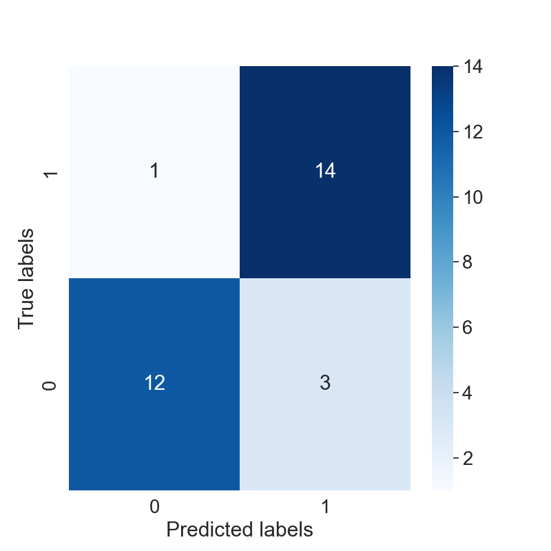

(a) 2ways-5shots

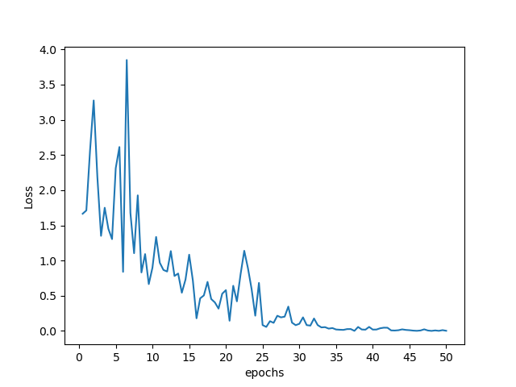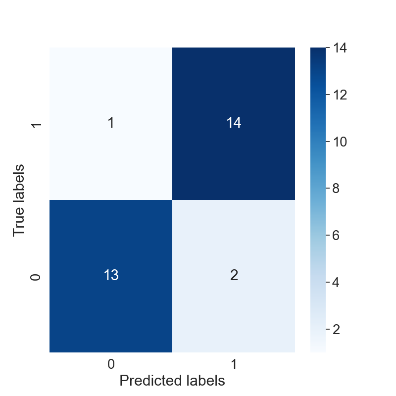

(b) 2ways-10shots

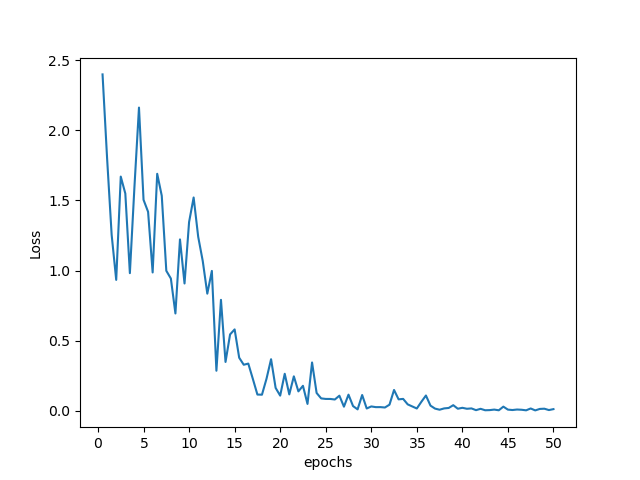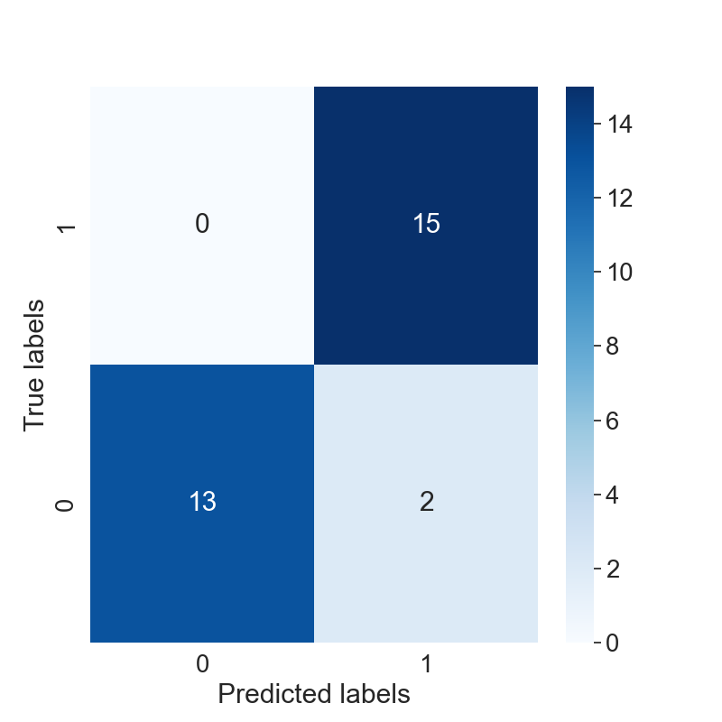

(c) 2ways-20shots

Fig 5.1 Confusion matrix of SNN (Best performance), 2ways-5, 10, 20shots in order (a)(b)(c)

All the result after hyperparameter tuning shows in the below Tab 5.1. It is clear that both of prototypical neural network and BD_CSPN network have the best performance which reached 96.7%:

Tab 5.1 The performance of different algorithms

| Networks                         | Siamese              | **Prototypical** | Relation | Matching | **BD_CSPN** |
|----------------------------------|----------------------|------------------|----------|----------|-------------|
| Embedding function               | CNN based on Lenet-5 | Resnet12         | Resnet12 | Resnet12 | Resnet12    |
| Best Performance (2ways-5shot)   | 86.7%                | 93.3%            | 73.3%    | 83.3%    | 93.3%       |
| Best Performance (2ways-10shots) | 90%                  | 93.3%            | 80%      | 86.7%    | 93.3%       |
| Best Performance (2ways-20shots) | 93.3%                | **96.7%**        | 80%      | 90%      | **96.7%**   |

## Transfer learning

After hyperparameter tuning, all the result shows in the below Tab 5.2, it shows the performance of the pretrain model and 3 new models:

Tab 5.2 The performance of Transfer learning model

|             | Binary classification model (Misalignment data) | D12 tool model (Experiment data) | D16 tool model (Experiment data) | D20 tool model (Experiment data) |
|-------------|-------------------------------------------------|----------------------------------|----------------------------------|----------------------------------|
| Performance | 93.4%                                           | 86.5%                            | 87.9%                            | 90.5%                            |

It can be seen in Tab 5.2 that the performance of Transfer learning is not very good. The reason is that the unbalanced sample category will lead to the classification with a small sample size which contains too few features, and it is difficult to extract the rules from it; even if the classification model is obtained, it is easy to produce over-reliance and limited data samples, which will lead to over-fitting problems. When the model is applied When applied to new data, the accuracy of the model will be poor. So SMOTE technique is required to improve the performance. The result shows on below Tab 5.3:

Tab 5.3 The performance of Transfer learning model with SMOTE technique

|             | Binary classification model (Misalignment data) | D12 tool model (Experiment data) | D16 tool model (Experiment data) | D20 tool model (Experiment data) |
|-------------|-------------------------------------------------|----------------------------------|----------------------------------|----------------------------------|
| Performance | 99%                                             | 91.2%                            | 93.2%                            | 93.9%                            |

## Contributors
- Dr.Mustafa Demetgül – Academic Supervisor

